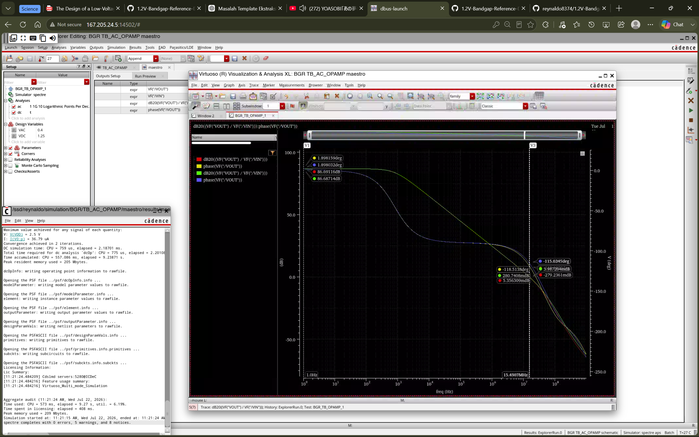

# 1.2 V Bandgap Reference in TSMC 65 nm CMOS

This repository documents the complete design of a **1.2 V Banba-style bandgap reference** in a TSMC 65 nm CMOS process, from transistor-level schematic verification to full-custom layout, physical verification, parasitic extraction, and post-layout simulation.

The circuit operates from a nominal 2.5 V supply and is designed to provide a stable 1.2 V reference for an LDO regulator across process, supply, and temperature variations.

---

## 1. Design Overview

### Design Conditions

| Parameter | Value |
|---|---:|
| Process | TSMC 65 nm CMOS |
| Nominal supply | 2.5 V |
| Target reference voltage | 1.2 V |
| Temperature range | -40 °C to 125 °C |
| Process corners | TT, SS, SF, FF, FS |
| Monte Carlo runs | 1000 samples |

### Final Electrical Performance

| Metric | Pre-Layout | Post-Layout | Conditions |
|---|---:|---:|---|
| Reference voltage | 1.2000534 V | 1.2000554 V | TT, 27 °C |
| TT temperature coefficient | 2.667 ppm/°C | 2.553 ppm/°C | -40 °C to 125 °C |
| Line regulation | 15.51 mV/V | 15.417727 mV/V | VDD = 2.0 V to 3.0 V, TT, 27 °C |
| Supply current | 87.16463 µA | 85.1725 µA | VDD = 2.5 V, TT, 27 °C |
| Power consumption | 217.911575 µW | 212.93125 µW | VDD = 2.5 V, TT, 27 °C |
| Low-frequency PSRR | -36.8861 dB | -36.9861 dB | TT, 27 °C |
| MC process mean | 1.20021 V | 1.20025 V | 1000 samples, 27 °C |
| MC process standard deviation | 1.96571 mV | 1.93490 mV | 1000 samples, 27 °C |
| MC mismatch mean | 1.20005 V | 1.20011 V | 1000 samples, 27 °C |
| MC mismatch standard deviation | 445.866 µV | 545.192 µV | 1000 samples, 27 °C |

The post-layout reference voltage and temperature coefficient are **final retuned results**. After extraction, the PTAT-path resistor was adjusted to recover the optimum temperature slope. The output resistor was then adjusted independently to recenter the TT output near 1.2 V at 27 °C.

---

## 2. Circuit Principle and Implementation

### 2.1 Banba Current-Summing Principle

The design follows the current-summing low-voltage bandgap principle. The amplifier regulates the two internal sensing nodes so that:

```math
V_X \approx V_Y
```

The two PNP devices use an emitter-area ratio of `N = 24`. Their base-emitter-voltage difference is:

```math
\Delta V_{BE}
=
V_{BE1}-V_{BE2}
=
V_T \ln(N)
```

where:

```math
V_T=\frac{kT}{q}
```

Because thermal voltage is proportional to absolute temperature, `ΔVBE` is a PTAT quantity. In this implementation, it appears across the small core resistor `R4`, producing the PTAT current:

```math
I_{\mathrm{PTAT}}
=
\frac{\Delta V_{BE}}{R_4}
=
\frac{V_T\ln(N)}{R_4}
```

The PNP base-emitter voltage provides the CTAT component. With `R5` and `R18` matched, the mirrored core current can be approximated by:

```math
I_{\mathrm{CORE}}
\approx
\frac{V_{BE1}}{R_{18}}
+
\frac{V_T\ln(N)}{R_4}
```

The first term decreases with temperature, while the second increases with temperature. First-order cancellation occurs when their slopes approximately satisfy:

```math
\frac{\mathrm{d}V_{BE1}}{\mathrm{d}T}
+
\frac{R_{18}}{R_4}
\frac{k}{q}\ln(N)
\approx 0
```

The output branch mirrors the core current into `R7`, giving:

```math
V_{\mathrm{REF}}
\approx
R_7 I_{\mathrm{CORE}}
```

or:

```math
V_{\mathrm{REF}}
\approx
\frac{R_7}{R_{18}}
\left[
V_{BE1}
+
\frac{R_{18}}{R_4}V_T\ln(N)
\right]
```

This relation separates the two tuning functions clearly:

| Element | Primary role |
|---|---|
| `R4 the one connects with N BJT` | Sets PTAT weighting and temperature coefficient |
| `R5 the one in the VX branch` and `R18 the one in the VY branch` | Preserve the matched Banba core branches |
| `R7 or output resistor` | Scales and centers the final reference voltage |
| PNP ratio `24:1` | Generates the PTAT `ΔVBE` term |
| Operational amplifier | Forces `VX ≈ VY` |
| Startup circuit | Prevents the zero-current operating point |

The temperature coefficient used in this project is:

```math
TC
=
\frac{
V_{\mathrm{REF,max}}-V_{\mathrm{REF,min}}
}{
V_{\mathrm{REF}}(27^\circ\mathrm{C})
\left(T_{\max}-T_{\min}\right)
}
\times 10^6
```

with `Tmin = -40 °C` and `Tmax = 125 °C`.

### 2.2 Complete BGR Schematic

<p align="center">
  
</p>

The schematic contains the Banba core, a 24:1 PNP array, matched resistor branches, an output-current mirror, an operational amplifier, a compensation network, and a startup circuit.

The resistor network is:

| Component | Function | Nominal value |
|---|---|---:|
| `R4` | PTAT-current generation | 12.3998 kΩ |
| `R5` | Core branch resistor | 73.5024 kΩ |
| `R18` | Matched core branch resistor | 73.5024 kΩ |
| `R7` | Output-current-to-voltage conversion | 75.179 kΩ |

### 2.3 Operational Amplifier

<p align="center">
  
</p>

The operational amplifier must provide adequate gain over the input common-mode range established by the BGR core. Finite gain creates an error between `VX` and `VY`, while input offset is amplified by the resistor ratio and directly shifts the final reference voltage.

The following figure compares the pre-layout and post-layout amplifier responses. The extracted response is expected to preserve sufficient DC gain, unity-gain bandwidth, and phase margin for correct BGR regulation.

<p align="center">
  
</p>

The exact gain, GBW, and phase-margin values are annotated in the table below.

| Parameter | Pre-Layout | Post-Layout | Difference |
|---|---:|---:|---:|
| DC Gain | 86.6912 dB | 86.6874 dB | −0.0038 dB |
| Gain-Bandwidth Product (GBW) | 15.4357 MHz | 15.8439 MHz | +0.4082 MHz |
| Phase Margin | 61.4862° | 60.8178° | −0.6684° |

The post-layout simulation results remain closely aligned with the pre-layout results. The extracted parasitic components cause only minor variations in gain, gain-bandwidth product, and phase margin, indicating that the op-amp performance is well preserved after layout extraction.

## 3. Pre-Layout Verification

### 3.1 Temperature and Process Corners

<p align="center">
  
</p>

The reference was swept from -40 °C to 125 °C across TT, SS, SF, FF, and FS. The nominal TT curve achieves a temperature coefficient of 2.667 ppm/°C.

<p align="center">
  
</p>

### 3.2 Line Regulation

<p align="center">
  
</p>

The supply was swept from 2.0 V to 3.0 V at TT and 27 °C. Line regulation was calculated as:

```math
\mathrm{LineReg}
=
\frac{
V_{\mathrm{OUT,max}}-V_{\mathrm{OUT,min}}
}{
V_{\mathrm{DD,max}}-V_{\mathrm{DD,min}}
}
```

The resulting pre-layout line regulation is 15.51 mV/V.

### 3.3 Startup

Startup was verified using fast, medium, and slow supply ramps (1 us, 100 us, 1 ms).

<p align="center">
  
</p>

<p align="center">
  
</p>

<p align="center">
  
</p>

All three cases converge to the intended bandgap operating point.

### 3.4 PSRR

<p align="center">
  
</p>

The plotted supply-to-output transfer is:

```math
\mathrm{PSRR}_{\mathrm{plot}}(f)
=
20\log_{10}
\left|
\frac{V_{\mathrm{OUT}}(f)}
{V_{\mathrm{DD}}(f)}
\right|
```

The low-frequency result at TT and 27 °C is -36.88 dB. More-negative values indicate stronger supply rejection in the displayed convention.

### 3.5 Monte Carlo Variation

#### Process Variation

<p align="center">
  
</p>

The 1000-sample process run gives a mean of 1.20021 V and a standard deviation of 1.96571 mV.

#### Device Mismatch

<p align="center">
  
</p>

The mismatch-only run gives a mean of 1.20005 V and a standard deviation of 445.866 µV. The wider process distribution shows that global process variation dominates the simulated absolute-output spread.

---

## 4. Layout and Physical Verification

### 4.1 Final Layout

<p align="center">
  
</p>

The layout integrates the 24-unit PNP array, segmented poly resistors, the BGR current mirrors, the operational amplifier, compensation components, power routing, and substrate/well contacts. Matched transistors and resistors were implemented using common-centroid and symmetric placement where applicable, while dummy transistors and dummy resistor segments were added at the array boundaries to reduce edge-related process variation. Repeated unit devices, balanced routing, and similar surrounding environments were also maintained to minimize systematic mismatch between critical branches. Guard rings and distributed substrate/well contacts were used to improve isolation and provide a low-resistance body connection, while the sensitive BGR core and amplifier input nodes were routed as symmetrically and compactly as practical.

### 4.2 DRC

The following configuration was used to run the Pegasus DRC verification.

<table>
  <tr>
    <th width="50%">DRC Run Data</th>
    <th width="50%">DRC Rule-Deck Configuration</th>
  </tr>
  <tr>
    <td>
      
    </td>
    <td>
      
    </td>
  </tr>
</table>

The run-data setup defines the layout cell and output directories, while the rule configuration selects the process-specific DRC rule deck.

#### DRC Result

<p align="center">
  
</p>

The final DRC run completed with a reviewed density-related warning. No geometry violation affecting the circuit connectivity or device implementation was identified.

### 4.3 LVS and ERC

<table>
  <tr>
    <td width="50%"></td>
    <td width="50%"></td>
  </tr>
  <tr>
    <td width="50%"></td>
    <td width="50%"></td>
  </tr>
</table>

<p align="center">
  
</p>

<p align="center">
  
</p>

**LVS status: MATCH**

The schematic and extracted layout contain equivalent devices, dimensions, and connectivity. The LVS run also generated the Pegasus query database used by Quantus.

<p align="center">
  
</p>

The ERC report includes a reviewed floating-well warning associated with the implemented device structure. It is retained in the documentation for traceability; the main LVS comparison remains matched.

---

## 5. Parasitic Extraction and Simulation Setup

The extraction flow is:

```text
Layout → Pegasus LVS/SVDB → Quantus RC extraction → SPICE netlist → Cadence ADE
```

### 5.1 Quantus Configuration

<table>
  <tr>
    <td width="50%"></td>
    <td width="50%"></td>
  </tr>
</table>

<p align="center">
  
</p>

<p align="center">
  
</p>

RC extraction was used for the final post-layout verification. No-parasitic and C-only extracted-device runs were also used during debugging to separate device-netlisting behavior from interconnect parasitics.

### 5.2 Extracted SPICE Integration

<p align="center">
  
</p>

<table>
  <tr>
    <td width="50%"></td>
    <td width="50%"></td>
  </tr>
</table>

### 5.3 PNP `AREA` Compatibility Issue

Quantus initially generated each extracted unit PNP with:

```spice
AREA=2.5e-11
```

The extracted netlist already represented the 24:1 ratio as one unit device in the small branch and 24 parallel unit devices in the large branch. In this simulator flow, directly using the physical area as the SPICE normalized `AREA` multiplier caused the PNP currents to collapse and forced `VX`, `VY`, and `VOUT` close to VDD.

For simulation, the generated netlist was copied and the unit-device parameter was changed to:

```spice
AREA=1
```

The 24 parallel PNP instances were retained, so the intended 24:1 ratio was preserved. This correction restored the expected 1.2 V operating point. The original PDK and original extraction output were not modified.

---

## 6. Post-Layout Results

### 6.1 Temperature and Process Corners

<p align="center">
  
</p>

After retuning `R4`, the TT post-layout temperature coefficient is 2.55 ppm/°C.

<p align="center">
  
</p>

After the temperature slope was restored, `R7` was adjusted to center the TT output at 27 °C near 1.2 V. The output resistor was not used to correct the temperature slope.

### 6.2 Line Regulation and Current

<p align="center">
  
</p>

The post-layout line regulation is 15.42 mV/V, essentially unchanged from the pre-layout result.

<p align="center">
  
</p>

At VDD = 2.5 V, the extracted circuit draws 85.17 µA. The corresponding nominal power is calculated directly as:

```math
P_{\mathrm{post}}
=
V_{\mathrm{DD}} I_{\mathrm{DD}}
=
(2.5\ \mathrm{V})(85.17\ \mu\mathrm{A})
=
212.9\ \mu\mathrm{W}
```

### 6.3 Startup

<p align="center">
  
</p>

<p align="center">
  
</p>

<p align="center">
  
</p>

The extracted circuit reaches the intended operating point for all three tested supply-ramp durations.

### 6.4 PSRR Robustness

#### Process Corners at 27 °C

<p align="center">
  
</p>

| Corner | Low-frequency PSRR |
|---|---:|
| TT | -36.9861 dB |
| SS | -36.6821 dB |
| SF | -36.1072 dB |
| FF | -37.1939 dB |
| FS | -37.7213 dB |

#### Temperature Variation at TT

<p align="center">
  
</p>

| Temperature | Low-frequency PSRR |
|---|---:|
| -40 °C | -38.8769 dB |
| 27 °C | -36.9861 dB |
| 125 °C | -34.5079 dB |

The displayed supply rejection is strongest at low temperature and degrades toward 125 °C.

### 6.5 Monte Carlo Variation

#### Process Variation

<p align="center">
  
</p>

The extracted 1000-sample process distribution has a mean of 1.20023 V and a standard deviation of 1.935 mV.

#### Device Mismatch

<p align="center">
  
</p>

The mismatch-only distribution has a mean of 1.20001 V and a standard deviation of 545.19 µV.

### 6.6 Final Comparison

| Metric | Pre-Layout | Post-Layout | Result |
|---|---:|---:|---|
| VREF at TT, 27 °C | 1.2000 V | 1.2001 V | Recentered after extraction |
| TT temperature coefficient | 2.66 ppm/°C | 2.55 ppm/°C | Restored by `R4` retuning |
| Line regulation | 15.51 mV/V | 15.42 mV/V | Preserved |
| Supply current | 87.16 µA | 85.17 µA | Slightly reduced |
| Low-frequency PSRR | -36.88 dB | -36.9861 dB | Preserved |
| MC process sigma | 1.96 mV | 1.935 mV | Nearly unchanged |
| MC mismatch sigma | 445.86 µV | 545.19 µV | Increased after extraction |
| Startup | Pass | Pass | Preserved |

The final extracted circuit retains the pre-layout performance after a deliberate two-step retuning procedure: `R4` was used for temperature-coefficient recovery and `R7` for nominal-voltage centering.

---

## 7. Future Improvements and References

Future revisions can add independent trim networks for the PTAT path and output resistor, allowing post-silicon calibration of temperature coefficient and nominal VREF. Other useful extensions include curvature compensation, output-noise characterization, improved high-temperature PSRR, lower-power biasing, and full tapeout preparation with pads, ESD protection, density fill, seal ring, and silicon measurement planning.

### References

1. H. Banba et al., “A CMOS Bandgap Reference Circuit with Sub-1-V Operation,” *IEEE Journal of Solid-State Circuits*, vol. 34, no. 5, 1999.
2. B. Razavi, “The Design of a Low-Voltage Bandgap Reference,” *IEEE Solid-State Circuits Magazine*, Summer 2021.
3. B. Razavi, *Design of Analog CMOS Integrated Circuits*, McGraw-Hill.
4. P. R. Gray, P. J. Hurst, S. H. Lewis, and R. G. Meyer, *Analysis and Design of Analog Integrated Circuits*, Wiley.
